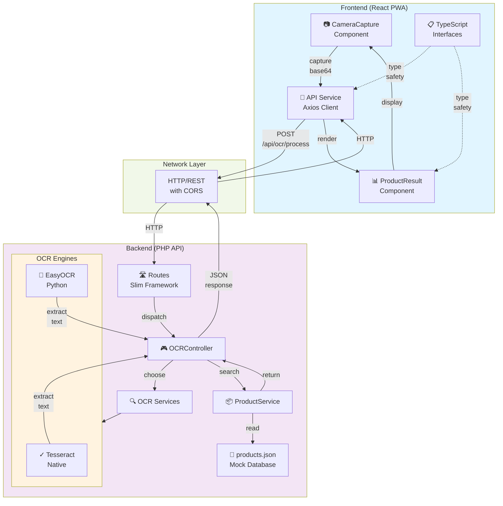
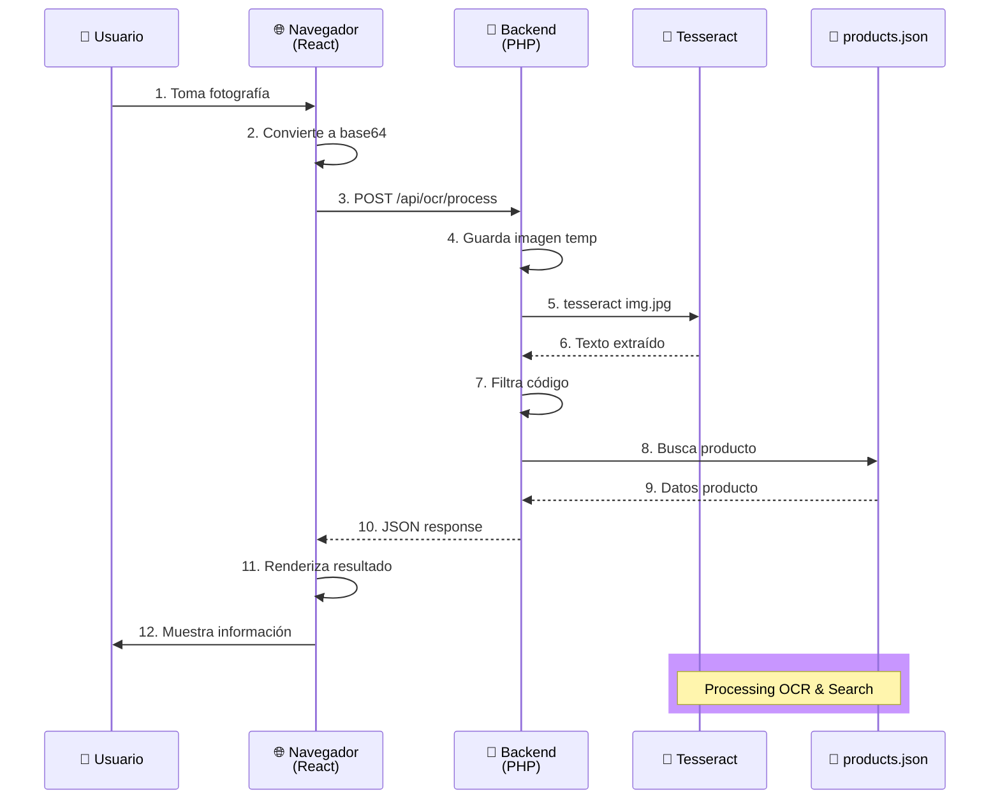

# LogistiQ - Arquitectura del Sistema

## Índice
1. [Análisis Arquitectónico](#análisis-arquitectónico)
2. [Stack Tecnológico](#stack-tecnológico)
3. [Estructura del Proyecto](#estructura-del-proyecto)
4. [Flujo de Datos](#flujo-de-datos)
5. [Arquitectura Visual](#arquitectura-visual)
6. [Consideraciones para el Proyecto Final](#consideraciones-para-el-proyecto-final)

---

## Análisis Arquitectónico

### Contexto del Proyecto

LogistiQ es una solución completa para la gestión de inventario y automatización de almacén. Este MVP validará:
- La viabilidad de usar OCR para reconocer códigos de productos desde fotografías
- La integración entre una app móvil (PWA) y un backend API
- El flujo de captura, procesamiento y búsqueda de productos

### Decisiones Arquitectónicas Principales

#### 1. **Separación Frontend/Backend (Arquitectura de Microservicios)**

**Decisión**: API REST independiente
- **Frontend**: React PWA (navegador web)
- **Backend**: PHP con Slim Framework

**Justificación**:
- Permite desarrollo independiente de ambas partes
- Facilita la migración futura a Rails sin afectar el frontend
- Escalabilidad: cada componente puede escalar por separado
- Frontend funciona offline como PWA
- Backend puede ser accedido desde múltiples clientes

#### 2. **Dual OCR Engines**

**Decisión**: Tesseract + EasyOCR
- Tesseract como motor principal (maduro y rápido)
- EasyOCR como alternativa (basado en ML, más preciso)

**Justificación**:
- Tesseract: instalación simple, requisitos bajos, bueno para texto estándar
- EasyOCR: mejor con variaciones, iluminación variable, deformaciones
- Permite comparar resultados y elegir el mejor
- Validación cruzada aumenta confiabilidad

#### 3. **Base de Datos JSON (MVP)**

**Decisión**: Archivo JSON en el servidor

**Justificación**:
- MVP no requiere complejidad de BD relacional
- Fácil de editar y mantener
- Sin dependencia de DB externa
- Migración fácil a PostgreSQL en proyecto final

#### 4. **Progressive Web App (PWA)**

**Decisión**: React con Vite + PWA Plugin

**Justificación**:
- Acceso a cámara del dispositivo
- Funciona en cualquier navegador moderno
- Puede cachear datos localmente
- Sin necesidad de App Store
- Compatible con dispositivos móviles y desktop

---

## Stack Tecnológico

### MVP Actual

#### Frontend
| Tecnología | Versión | Propósito |
|-----------|---------|----------|
| React | 19.0 | Framework UI |
| TypeScript | 5.3 | Type safety |
| Vite | 5.0 | Build tool (rápido) |
| Tailwind CSS | 3.3 | Estilos |
| Axios | 1.6 | HTTP client |
| Vite PWA Plugin | 0.17 | PWA support |

#### Backend
| Tecnología | Versión | Propósito |
|-----------|---------|----------|
| PHP | 8.0+ | Runtime |
| Slim Framework | 4.0 | HTTP routing |
| Tesseract OCR | 5.0+ | OCR engine |
| EasyOCR | Latest | OCR alternativo |
| JSON | - | Base de datos |

---

## Estructura del Proyecto

### Árbol de Directorios

```
MVP-LogistiQ/
│
├── frontend/                        # React PWA
│   ├── src/
│   │   ├── components/
│   │   │   ├── CameraCapture.tsx   # Captura de fotos + upload
│   │   │   ├── ProductResult.tsx   # Mostrar resultados
│   │   │   └── LoadingSpinner.tsx  # Estado loading
│   │   ├── services/
│   │   │   └── api.ts              # Cliente Axios configurado
│   │   ├── types/
│   │   │   └── product.ts          # Interfaces TypeScript
│   │   ├── App.tsx                 # Componente principal
│   │   ├── main.tsx                # Entry point
│   │   └── index.css               # Estilos base
│   ├── public/
│   │   └── (archivos estáticos)
│   ├── index.html                  # Template HTML
│   ├── package.json
│   ├── vite.config.ts              # Config Vite + PWA
│   ├── tsconfig.json
│   ├── tailwind.config.js
│   ├── postcss.config.js
│   └── .env.example
│
├── backend/                         # API REST PHP
│   ├── public/
│   │   └── index.php               # Entry point (Slim)
│   ├── src/
│   │   ├── Controllers/
│   │   │   └── OCRController.php   # Lógica de endpoints
│   │   ├── Services/
│   │   │   ├── TesseractService.php# Integración Tesseract
│   │   │   ├── EasyOCRService.php  # Integración EasyOCR
│   │   │   └── ProductService.php  # Búsqueda en JSON
│   │   └── Middleware/
│   │       └── CorsMiddleware.php  # CORS headers
│   ├── data/
│   │   └── products.json           # Base de datos
│   ├── scripts/
│   │   └── easyocr_process.py      # Script Python OCR
│   ├── uploads/                    # Imágenes temporales
│   ├── composer.json
│   └── .htaccess                   # Rewrite rules
│
├── scripts/                         # Scripts de instalación
│   ├── setup-tesseract.sh
│   └── setup-easyocr.sh
│
├── docs/
│   └── ARCHITECTURE.md             # Este archivo
│
└── README.md                        # Documentación general
```

### Responsabilidades por Módulo

#### Frontend (`/frontend`)
- **Captura de fotografías** desde cámara del dispositivo
- **Conversión a base64** para enviar al backend
- **Llamadas a API REST** para procesar imágenes
- **Visualización de resultados** (producto encontrado)
- **Manejo de estados** (loading, error, success)
- **PWA capabilities** (offline, caching)

#### Backend (`/backend`)
- **API REST endpoints** para recibir imágenes
- **Validación de entrada** (formato base64, tamaño)
- **Procesamiento OCR** (Tesseract + EasyOCR)
- **Filtrado de texto** (extracción de códigos)
- **Búsqueda en BD** (JSON)
- **Respuestas JSON** con producto encontrado

#### Servicios de OCR
- **TesseractService**: Maneja ejecución de tesseract vía shell_exec
- **EasyOCRService**: Llama a script Python que usa EasyOCR

#### Base de Datos
- **products.json**: Almacena catálogo de productos
- Estructura simple: array de objetos producto
- Fácil de editar manualmente

---

## Flujo de Datos

### Flujo Principal: Captura y Búsqueda de Producto

```
┌─────────────────────────────────────────────────────────────────┐
│ CLIENTE (React PWA)                                              │
├─────────────────────────────────────────────────────────────────┤
│                                                                   │
│  1. Usuario abre cámara o selecciona imagen                     │
│  2. Captura fotografía de etiqueta de producto                  │
│  3. Convierte imagen a base64                                   │
│  4. Envía POST /api/ocr/process { image, engine }              │
│                                                                   │
└─────────────────────────────────────────────────────────────────┘
                            ↓
                     ┌──────────────┐
                     │ HTTP Request │
                     │ CORS enabled │
                     └──────────────┘
                            ↓
┌─────────────────────────────────────────────────────────────────┐
│ SERVIDOR (PHP API)                                               │
├─────────────────────────────────────────────────────────────────┤
│                                                                   │
│  5. OCRController recibe request                                │
│  6. Valida base64 y parámetros                                  │
│  7. Elige motor OCR (Tesseract/EasyOCR)                         │
│                                                                   │
│     ┌──────────────────────────────────────────┐               │
│     │ OCR Processing                            │               │
│     ├──────────────────────────────────────────┤               │
│     │ 8a. TesseractService:                    │               │
│     │     - Guarda imagen temporal             │               │
│     │     - Ejecuta: tesseract img.jpg output  │               │
│     │     - Lee archivo output.txt             │               │
│     │     - Filtra y normaliza texto           │               │
│     │                                           │               │
│     │ 8b. EasyOCRService:                      │               │
│     │     - Guarda imagen temporal             │               │
│     │     - Ejecuta script Python              │               │
│     │     - Python carga modelo EasyOCR       │               │
│     │     - Retorna JSON con texto            │               │
│     │     - Filtra y normaliza texto           │               │
│     └──────────────────────────────────────────┘               │
│                                                                   │
│  9. Filtra resultado OCR (extrae código)                        │
│  10. ProductService busca en products.json                      │
│  11. Encuentra producto o retorna error                         │
│                                                                   │
└─────────────────────────────────────────────────────────────────┘
                            ↓
                     ┌──────────────┐
                     │ HTTP Response│
                     │ JSON + CORS  │
                     └──────────────┘
                            ↓
┌─────────────────────────────────────────────────────────────────┐
│ CLIENTE (React PWA)                                              │
├─────────────────────────────────────────────────────────────────┤
│                                                                   │
│  12. Recibe respuesta JSON:                                     │
│      {                                                           │
│        "success": true,                                          │
│        "ocr_result": { raw_text, filtered_code, engine },      │
│        "product": { code, name, price, stock, ... }            │
│      }                                                           │
│                                                                   │
│  13. ProductResult renderiza información                        │
│  14. Usuario ve detalles del producto                           │
│                                                                   │
└─────────────────────────────────────────────────────────────────┘
```

### Flujo Alternativo: Búsqueda Directa

```
Cliente → GET /api/products/{code} → ProductService → JSON → Cliente
```

---

## Arquitectura Visual

### Diagrama de Componentes



### Diagrama de Secuencia



---

## Consideraciones para el Proyecto Final

### Migración a Ruby on Rails

#### Backend Cambios Principales
```
Actual (MVP)          →    Final (Rails)
─────────────────────────────────────────
PHP 8.0              →    Ruby 3.0+
Slim Framework       →    Rails 7.0+
JSON file            →    PostgreSQL
Tesseract via exec   →    Active Job + Sidekiq
```

#### Stack Final Propuesto

| Componente | MVP | Final |
|-----------|-----|-------|
| **Frontend** | React 19 PWA | React 19 PWA (mejorada) |
| **Backend API** | PHP + Slim | Rails 7 + Hotwire |
| **Base de Datos** | JSON | PostgreSQL 15+ |
| **Procesamiento Async** | N/A | Sidekiq (background jobs) |
| **OCR** | Tesseract/EasyOCR | Tesseract/EasyOCR (mismo) |
| **Autenticación** | N/A | Devise + JWT |
| **Admin Panel** | N/A | Rails admin UI |
| **API Docs** | Manual | Swagger/OpenAPI |
| **Depliegue** | Local | DigitalOcean |

#### Estructura Rails Final

```
logistiq-rails/
├── app/
│   ├── models/
│   │   ├── product.rb
│   │   ├── supplier.rb
│   │   ├── warehouse_location.rb
│   │   ├── inventory_movement.rb
│   │   └── user.rb
│   ├── controllers/
│   │   ├── api/
│   │   │   ├── v1/
│   │   │   │   ├── ocr_controller.rb
│   │   │   │   ├── products_controller.rb
│   │   │   │   └── inventory_controller.rb
│   │   └── admin/
│   │       ├── suppliers_controller.rb
│   │       └── dashboard_controller.rb
│   ├── views/
│   │   ├── admin/
│   │   │   ├── dashboard/
│   │   │   ├── products/
│   │   │   └── suppliers/
│   │   └── layouts/
│   ├── jobs/
│   │   └── ocr_processing_job.rb
│   └── services/
│       ├── ocr_service.rb
│       └── inventory_service.rb
├── db/
│   └── migrate/
│       ├── 20240101000000_create_products.rb
│       ├── 20240101000001_create_suppliers.rb
│       └── ...
└── config/
    ├── routes.rb
    └── database.yml
```

### Mejoras en Frontend

```
MVP Actual:
- Captura básica
- Resultados simples
- Sin autenticación

Final (Rails integration):
- Múltiples OCR engines
- Cache local (service worker)
- Historial de búsquedas
- Sincronización offline
- Autenticación con JWT
- Búsqueda avanzada
- Reportes
- Notificaciones push
```

### Escalabilidad

#### MVP (actual)
- Single PHP server
- JSON file storage
- No cache
- Procesamiento síncrono

#### Final
- Load balancer (Nginx)
- PostgreSQL con replicación
- Redis para cache
- Sidekiq para jobs async
- CDN para images
- Horizontal scaling

### Infraestructura DigitalOcean

```
┌─────────────────────────────────┐
│  DigitalOcean Infrastructure    │
├─────────────────────────────────┤
│                                 │
│  Droplet 1 (App + Rails)        │
│  - 2 vCPU, 4GB RAM              │
│  - Nginx reverse proxy          │
│  - Rails server (Puma)          │
│                                 │
│  Droplet 2 (Backup)             │
│  - Replicación BD               │
│                                 │
│  Managed PostgreSQL             │
│  - 1GB/mes (~€15)               │
│                                 │
│  Spaces (S3-like)               │
│  - Almacenamiento imágenes      │
│  - €5/mes                       │
│                                 │
│  CDN                            │
│  - Distribución global          │
│  - €5/mes                       │
│                                 │
└─────────────────────────────────┘
```

---

## Resumen

### Ventajas de esta Arquitectura

- ✅ **Separación de responsabilidades**: Frontend y backend completamente desacoplados
- ✅ **Escalabilidad**: Cada capa puede escalar independientemente
- ✅ **Validación rápida**: MVP funcional para proof-of-concept
- ✅ **Flexibilidad**: Fácil migración a stack final (Rails)
- ✅ **Confiabilidad**: Dual OCR engines para mayor precisión
- ✅ **Usabilidad**: PWA para acceso desde cualquier dispositivo

### Áreas de Mejora Futuras

- 📋 **Procesamiento asíncrono**: Jobs en background (OCR intensive)
- 🔐 **Autenticación**: JWT + OAuth para usuarios
- 📊 **Analytics**: Tracking de búsquedas y productos
- 🔄 **Sincronización**: Offline-first con IndexedDB
- 🌐 **Internacionalización**: Soporte múltiples idiomas/monedas

### Conclusión

El MVP LogistiQ proporciona una base sólida para validar la viabilidad de la solución OCR en un contexto de gestión de inventario. La arquitectura es escalable y preparada para la evolución hacia la solución empresarial final con Ruby on Rails.
